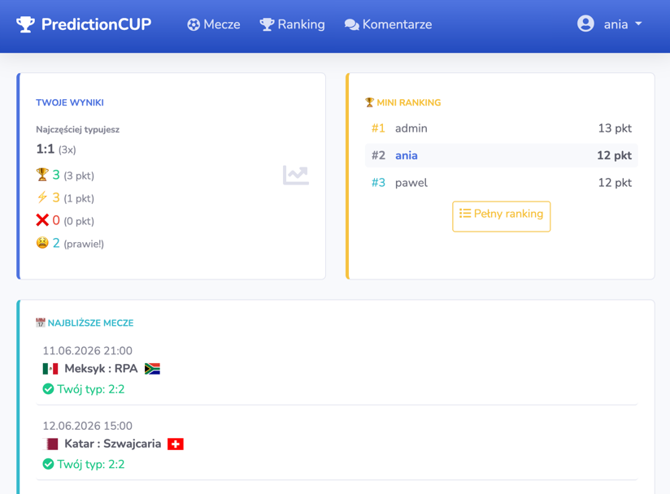
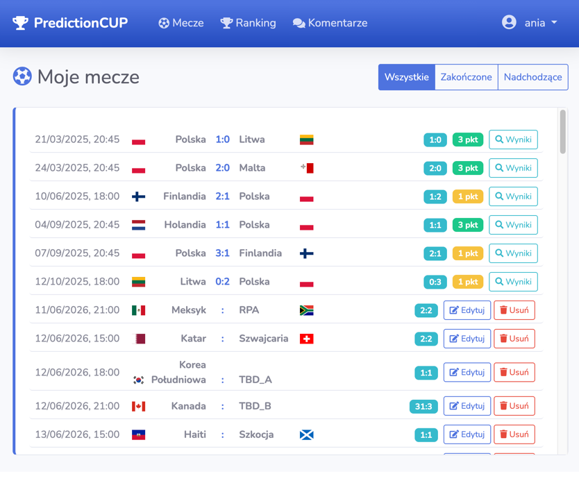
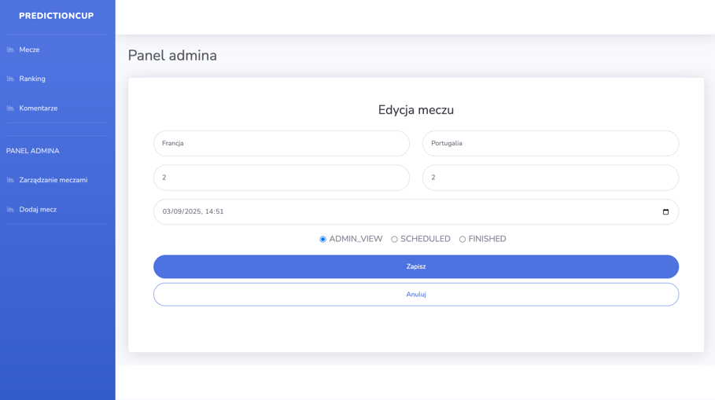
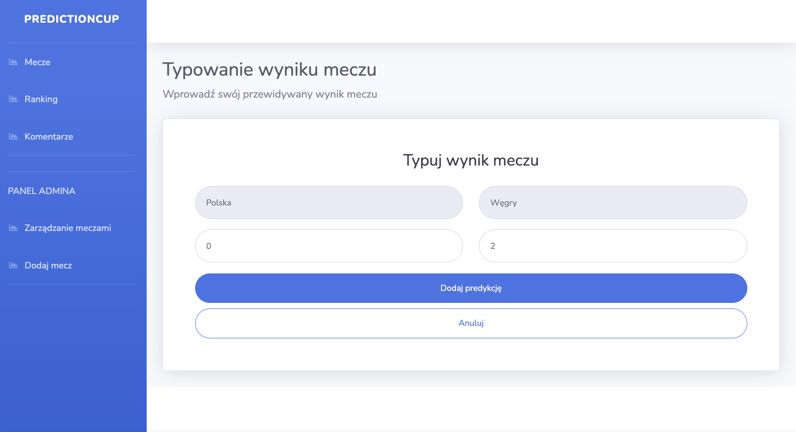
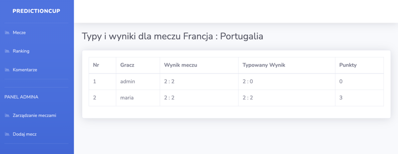

# 🏆 PredictionCup

PredictionCup is a web application for predicting match results, featuring a scoring system and player rankings.
Users can predict games outcomes, earn points, and compete in the ranking system.
Administrators have the ability to menage games.

---

## Features

### User Features

- User registration and login (username-based authentication),
- Change password functionality,
- Browse available games (SCHEDULED and FINISHED),
- Submit or update predictions before game start,
- Earn points after game completion,
- View ranking with current position and position changes compared to previous matches,
- View other players’ predictions and points after game completion,
- Comment section for public discussions.




---

### Admin Features

- Add, update, delete game,
- Admin-only game view with ADMIN_VIEW status,
- Change game status: When status changes to FINISHED, points are automatically calculated,
- Restrict deletion of games to those with ADMIN_VIEW status.



---

## Technology Stack

- **Backend**:
  - Spring Boot
  - Spring Data JPA
  - Spring Security
  - Spring Validation
  - Lombok
  - MySQL
  - OpenAPI (Swagger UI)

- **Frontend**:
  - Thymeleaf
  - Bootstrap 5
  - thymeleaf-extras-springsecurity

---

## Application Structure

- `/register` – User registration,
- `/login` – User login,
- `/games` – All games list,
- `/ranking` – User ranking
- `/predictions/new/..` - Predictions create,
- `/predictions/edit/..` - Predictions update,
- `/results/..` - All users predictions and points for a specific game,
- `/comments` - Comment section,


Admin:
- `/admin/games` - Game management
- `/admin/games/new` - Add game,
- `/admin/games/edit/..` - Update game,

REST:
- `/swagger-ui/index.html` - REST API documentation

---

## Requirements

- Java 17+
- Maven 3+
- MySQL 8+
- Web browser

---

## Getting Started

1. **Clone the repository**
   ```bash
   git clone https://github.com/twoje-repo/PredictionCup.git
   cd PredictionCup

2. **Configure database**

- Create MySQL database
- Update application.properties with your database credentials

3. **Build and run the application**


```bash
mvn clean install
mvn spring-boot:run
```

4.**Access the application**

- Main application: http://localhost:8080

- Swagger API documentation: http://localhost:8080/swagger-ui.html


## Key Functionality

### Game Management for Admin
- Add, update, delete games,
- Deletion is only allowed for games with the ADMIN_VIEW status,
- Validation ensures correct date and status when creating or updating a game,
- Changing a game’s status to FINISHED automatically triggers the calculation of prediction points.




### Game Score Prediction
- Users can view a list of games with SCHEDULED and FINISHED statuses.
- For SCHEDULED games, users can submit score predictions.
- Predictions can be updated multiple times before the game start time.
- After the admin changes the game status to FINISHED, points are calculated
  - **3 points** - exact score prediction,
  - **1 point** - correct winner/draw prediction with wrong score,
  - **0 points** - incorrect prediction,
  

  

  
### Ranking System
- Rankings are updated after each finished game based on points earned from predictions.
- Displays each user’s current position and changes compared to the previous round (promotions/demotions).




### Match Status
- Every match must have a defined status at all times.
- Validation prevents adding results unless the match status is set to FINISHED.

### Comment section
- Users can post comments visible to all participants.

## Roadmap
- Enhenced dashboard with statistics

