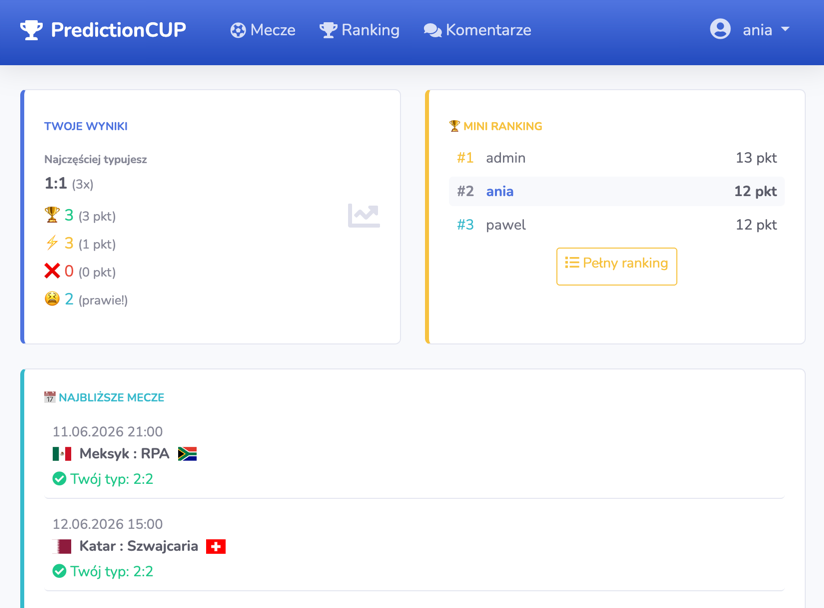
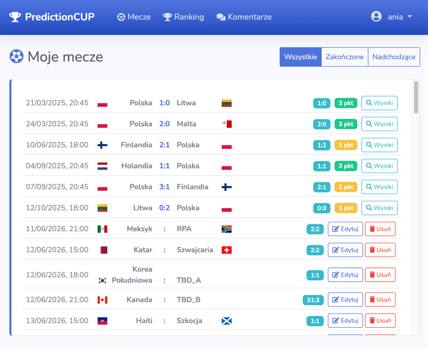
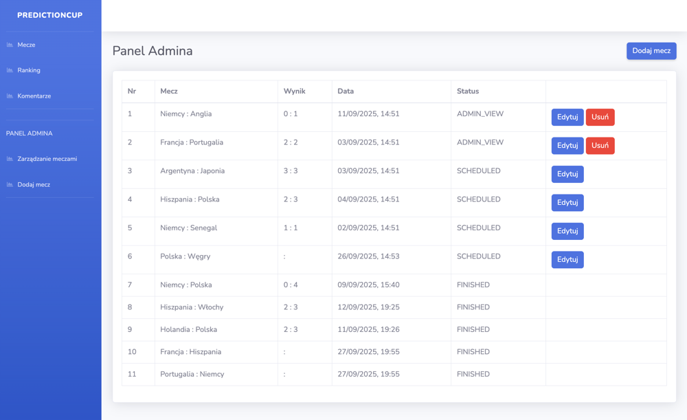
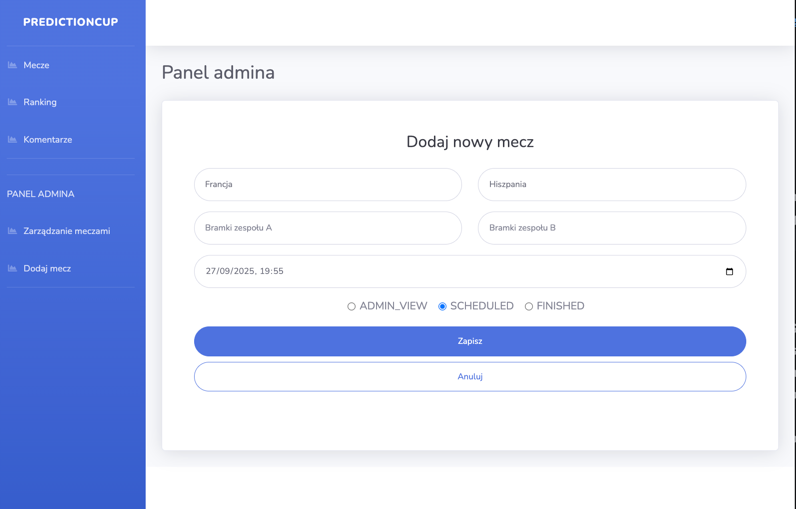
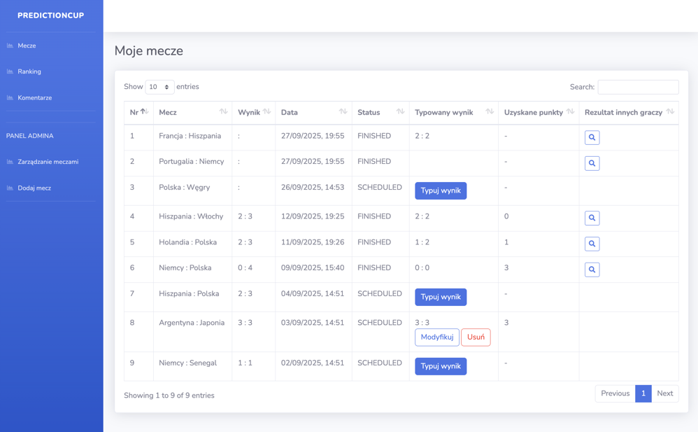
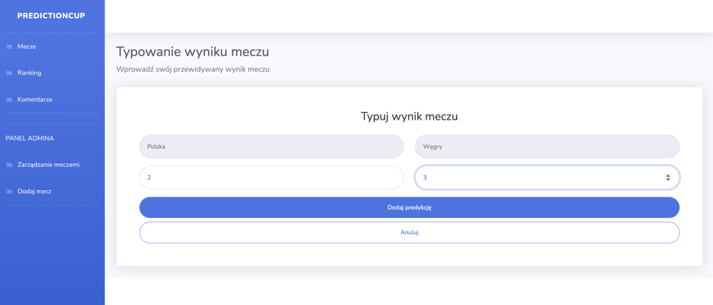
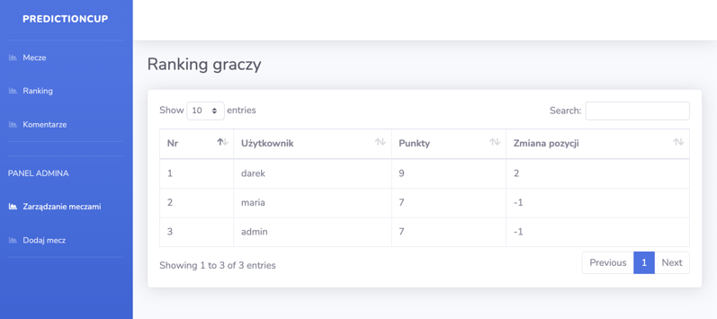
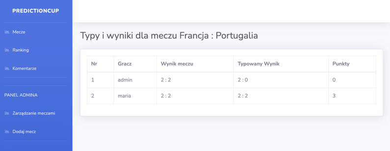
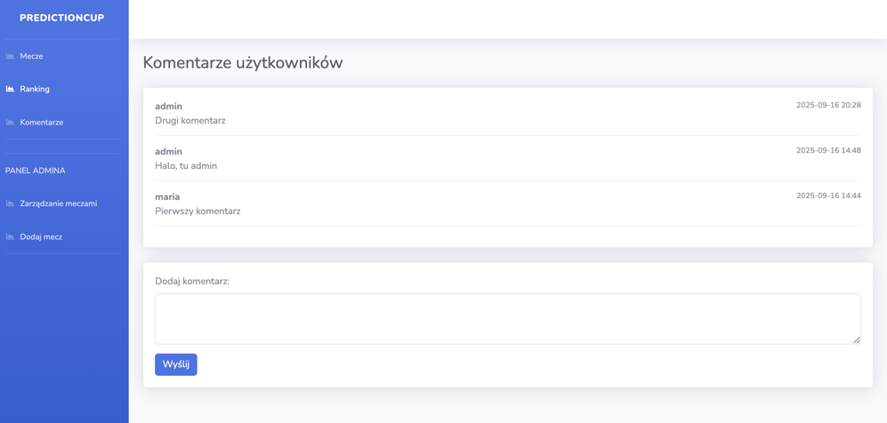

# 🏆 PredictionCup

PredictionCup is a web application for predicting match results, featuring a scoring system and player rankings.
Users can predict game outcomes, earn points, and compete in the ranking system.
Administrators have the ability to manage games.

---

## 📋 Table of Contents

- [Features](#features)
- [Technology Stack](#technology-stack)
- [Running the Application with Docker](#-running-the-application-with-docker)
- [Access the Application](#access-the-application)
- [Managing Containers](#managing-containers)
- [Application Structure](#application-structure)
- [API Endpoints](#api-endpoints)
- [Roadmap](#roadmap)

---

## Features

### User Features

- **User Authentication**
  - User registration and login (username-based authentication)
  - Change password functionality
  - User profile management with avatar support

- **Game Predictions**
  - Browse available games (SCHEDULED and FINISHED)
  - Submit or update predictions before game start
  - Earn points after game completion
  - View other players' predictions and points after game completion

- **League System**
  - Join multiple leagues
  - Switch between different leagues
  - League-specific rankings and competitions
  - View league members

- **Ranking System**
  - View current ranking position
  - Track position changes compared to previous matches
  - **Interactive ranking history chart**:
    - Visualize position changes over time for all games
    - Sharp line graphs showing exact position movements
    - Filter users: show only yourself, top 3/5 + you, or all users
    - Search for specific users to compare
    - Click legend to toggle user visibility
    - Hover over lines to highlight specific users

- **Social Features**
  - **Posts system**: Create, edit, and delete posts within your league
    - Add GIFs to posts (via GIF picker)
    - React to posts with emojis
    - Comment on posts with quote and reply functionality
    - React to comments with emojis
  - **Real-time chat**: Public chat for all league members
  - View other users' prediction statistics and patterns




---

### Admin Features

- Add, update, delete games
- Admin-only game view with ADMIN_VIEW status
- Change game status: When status changes to FINISHED, points are automatically calculated
- Restrict deletion of games to those with ADMIN_VIEW status
- Manage leagues and league memberships



---

## Technology Stack

- **Backend**:
  - Spring Boot
  - Spring Data JPA
  - Spring Security
  - Spring Validation
  - Lombok
  - MySQL
  - OpenAPI (Swagger UI)

- **Frontend**:
  - React 18
  - Vite
  - React Router
  - React Bootstrap
  - Chart.js (for ranking history visualization)
  - Emoji Picker React
  - date-fns (date formatting)
  - nginx (static file serving and API proxy)

- **Infrastructure**:
  - Docker
  - Docker Compose
  - MySQL 8.0

---

## 🚀 Running the Application with Docker

### Prerequisites

- **Docker Desktop** (version 20.10 or newer)
- **Docker Compose** (version 2.0 or newer)
- **Frontend repository** cloned next to backend

### Repository Structure

**IMPORTANT**: Both repositories must be cloned in the same parent directory:

```
workspace/coderslab/
├── demo/         (backend - this repository)
└── demo-front/   (frontend - React application)
```

⚠️ **Note**: The frontend directory must be named `demo-front` (with hyphen), matching the GitHub repository name.

### Check if Docker is installed

```bash
docker --version
docker-compose --version
```

If Docker is not installed, download it from [https://www.docker.com/products/docker-desktop](https://www.docker.com/products/docker-desktop)

---

### Step 1: Clone the repositories

```bash
# Create workspace directory
mkdir -p workspace/coderslab
cd workspace/coderslab

# Clone backend
git clone <backend-repo-url> demo

# Clone frontend (MUST be named demo-front)
git clone <frontend-repo-url> demo-front

# Navigate to backend directory
cd demo
```

**Alternative with SSH**:
```bash
cd workspace/coderslab
git clone git@github.trusted.visa.com:your-org/demo.git
git clone git@github.trusted.visa.com:your-org/demo-front.git
cd demo
```

---

### Step 2: Start the application

The application uses Docker Compose which automatically:
- Builds the Spring Boot backend application
- Builds the React frontend application
- Creates MySQL database
- Initializes the database with sample data

**Start all containers:**

```bash
docker-compose up -d
```

This single command starts **all 3 containers**:
1. MySQL database (`prediction-mysql`)
2. Spring Boot backend (`prediction-app`)
3. React frontend (`prediction-frontend`)

---

### Step 3: Wait for the application to start

The application needs approximately **60-90 seconds** to fully start. You can monitor the logs:

```bash
# Check container status
docker-compose ps

# View all logs
docker-compose logs -f

# View specific container logs
docker logs prediction-app -f        # Backend
docker logs prediction-frontend -f   # Frontend
docker logs prediction-mysql -f      # Database
```

The application is ready when you see:
```
Started DemoApplication in X.XXX seconds (backend)
```

---

## Access the Application

After starting the application, you can access it at the following addresses:

### 🌐 Main Application (Frontend)
- **React App**: [http://localhost:3000](http://localhost:3000)
- **Login credentials**:
  - Username: `ania` / Password: `123qweasd`
  - Username: `admin` / Password: `admin123`

### 🔧 Backend API
- **API Base URL**: [http://localhost:8080/api](http://localhost:8080/api)
- **Swagger UI**: [http://localhost:8080/swagger-ui/index.html](http://localhost:8080/swagger-ui/index.html)

### 🗄️ Database Management
- **MySQL CLI**: Connect via Docker command
  ```bash
  docker exec -it prediction-mysql mysql -uroot -proot betsdb
  ```
  - Username: `root`
  - Password: `root`
  - Database: `betsdb`

---

## Managing Containers

### View running containers

```bash
docker-compose ps
```

### Stop all containers

```bash
docker-compose stop
```

Containers are stopped but not removed. Data is preserved.

### Start stopped containers

```bash
docker-compose start
```

### Restart all containers

```bash
docker-compose restart
```

### Restart specific container

```bash
docker-compose restart frontend    # Frontend only
docker-compose restart app         # Backend only
docker-compose restart mysql       # Database only
```

### Stop and remove containers

```bash
docker-compose down
```

Removes containers but keeps volumes (database data is preserved).

### Stop and remove containers with data (⚠️ DELETES DATABASE!)

```bash
docker-compose down -v
```

⚠️ **WARNING**: This command will delete all data from the database!

---

## Rebuilding After Code Changes

### Rebuild frontend after code changes

```bash
docker-compose build frontend
docker-compose up -d frontend
```

Or in one command:

```bash
docker-compose up -d --build frontend
```

### Rebuild backend after code changes

```bash
docker-compose build app
docker-compose up -d app
```

Or in one command:

```bash
docker-compose up -d --build app
```

### Rebuild everything

```bash
docker-compose down
docker-compose build --no-cache
docker-compose up -d
```

---

## Development Workflow

### Option 1: All in Docker (Production-like)

✅ **Pros**: Matches production environment
❌ **Cons**: Need to rebuild after every frontend code change

```bash
docker-compose up -d
# Access frontend at http://localhost:3000
```

### Option 2: Local Frontend + Docker Backend (Recommended for Development)

✅ **Pros**: Hot reload on frontend changes, no rebuild needed
❌ **Cons**: Need npm installed locally

```bash
# Stop frontend container
docker-compose stop frontend

# Start frontend locally with hot reload
cd ../demo-front
npm install  # Only first time
npm run dev  # Start dev server

# Access frontend at http://localhost:5173
# Backend still runs in Docker at http://localhost:8080
```

---

## Viewing Logs

### View logs from all containers

```bash
docker-compose logs -f
```

### View logs from specific container

```bash
docker logs prediction-app -f         # Backend
docker logs prediction-frontend -f    # Frontend
docker logs prediction-mysql -f       # Database
```

### View last N lines of logs

```bash
docker logs prediction-app --tail 100
```

---

### Database Management

```bash
# Connect to MySQL via terminal
docker exec -it prediction-mysql mysql -uroot -proot betsdb

# Example queries
USE betsdb;
SHOW TABLES;
SELECT * FROM user LIMIT 10;
SELECT * FROM league;
```

---

## Docker Structure

### Docker Compose contains 3 services:

1. **mysql** (`prediction-mysql`)
   - Image: `mysql:8.0`
   - Port: `3306`
   - Database: `betsdb`
   - Initialization: Automatic via scripts in `/docker/mysql/init/`
   - Encoding: UTF-8 (utf8mb4)

2. **app** (`prediction-app`)
   - Built from `Dockerfile` (Spring Boot)
   - Port: `8080`
   - Depends on: `mysql` (waits for health check)
   - Automatically connects to the database

3. **frontend** (`prediction-frontend`)
   - Built from `../demo-front/Dockerfile` (React + Vite + nginx)
   - Port: `3000` (mapped to container port 80)
   - nginx serves static files and proxies `/api` requests to backend
   - Depends on: `app`

### Database Initialization

The database is automatically initialized on first startup by SQL scripts in order:

1. `00-set-encoding.sh` - Character encoding setup
2. `01-create-tables.sql` - Table creation
3. `02-league-support.sql` - League system tables
4. `03-create-leagues.sql` - Initial leagues
5. `04-create-users.sql` - Sample users
6. `05-assign-users-to-leagues.sql` - User-league assignments
7. `06-create-countries.sql` - Countries data
8. `07-finished-games.sql` - Completed games with results
9. `08-upcoming-games.sql` - Scheduled games
10. `09-create-predictions.sql` - Sample predictions
11. `10-calculate-ranking-history.sql` - Ranking history data
12. `11-calculate-user-points.sql` - User points calculation
13. `12-add-chat-messages.sql` - Sample chat messages
14. `13-add-posts.sql` - Sample posts and comments

---

## Troubleshooting

### Frontend container fails to build

If you get an error like "failed to compute cache key" or "context path not found":
- **Check directory structure**: Make sure `demo-front` directory exists next to `demo`
- **Correct structure**:
  ```
  workspace/coderslab/
  ├── demo/         (backend)
  └── demo-front/   (frontend) ← must be named exactly "demo-front"
  ```
- **Custom location**: If your frontend is elsewhere, use:
  ```bash
  FRONTEND_PATH=/path/to/your/frontend docker-compose up -d
  ```

### Frontend shows gray overlay and can't click anything

If the frontend loads but shows a gray semi-transparent overlay blocking interaction:
- The LeagueSelector dropdown is open
- Click anywhere on the gray area to close it
- If problem persists, rebuild frontend: `docker-compose build frontend && docker-compose up -d frontend`

### Port already in use

```bash
# Check what's using the port
lsof -i :3000  # Frontend
lsof -i :8080  # Backend
lsof -i :3306  # MySQL

# Kill the process or stop the container
docker-compose down
```

### Database connection issues

```bash
# Check if MySQL is healthy
docker-compose ps

# Wait for MySQL to be healthy (may take 30-60 seconds)
docker logs prediction-mysql -f

# Restart backend if it started before MySQL was ready
docker-compose restart app
```

### Rebuild from scratch

```bash
# Remove everything including volumes
docker-compose down -v

# Rebuild without cache
docker-compose build --no-cache

# Start fresh
docker-compose up -d
```

---

## Application Structure

### Frontend Routes (React SPA)

- `/` – Dashboard with upcoming matches and statistics
- `/games` – Browse and predict game results
- `/ranking` – User ranking with interactive history chart
- `/chat` – Real-time chat for league members
- `/posts` – League posts with reactions and comments
- `/profile` – User profile management
- `/login` – User login
- `/register` – User registration

### Admin Panel

- Admin game management interface
- League administration
- User management

### REST API

- `/swagger-ui/index.html` - REST API documentation
- All API endpoints are prefixed with `/api`

---

## Key Functionality

### Game Management (Administrator)
- Add, update, delete games
- Deletion is only allowed for games with the ADMIN_VIEW status
- Validation ensures correct date and status when creating or updating a game
- Changing a game's status to FINISHED automatically triggers the calculation of prediction points



### Game Score Prediction
- Users can view a list of games with SCHEDULED and FINISHED statuses
- For SCHEDULED games, users can submit score predictions
- Predictions can be updated multiple times before the game start time
- After the admin changes the game status to FINISHED, points are calculated:
  - **3 points** - exact score prediction
  - **1 point** - correct winner/draw prediction with wrong score
  - **0 points** - incorrect prediction





### Ranking System
- Rankings are updated after each finished game based on points earned from predictions
- Displays each user's current position and changes compared to the previous round (promotions/demotions)





### Match Status
- Every match must have a defined status at all times
- Validation prevents adding results unless the match status is set to FINISHED

### Comment Section
- Users can post comments visible to all participants



---

## API Endpoints

### Admin Endpoints
| Method   | Endpoint                  | Description                    |
|----------|---------------------------|--------------------------------|
| `GET`    | `/api/admin/games`        | Get all games visible for admin|
| `GET`    | `/api/admin/games/{id}`   | Get game by ID                 |
| `POST`   | `/api/admin/games`        | Create new game                |
| `PUT`    | `/api/admin/games/{id}`   | Update game                    |
| `DELETE` | `/api/admin/games/{id}`   | Delete game                    |

### User Management
| Method   | Endpoint           | Description              |
|----------|--------------------|--------------------------|
| `GET`    | `/api/user`        | Get all users            |
| `GET`    | `/api/user/{id}`   | Get user by ID           |
| `POST`   | `/api/user`        | Create new user          |
| `PUT`    | `/api/user`        | Update user password     |
| `DELETE` | `/api/user/{id}`   | Delete user              |

### Games
| Method   | Endpoint               | Description                        |
|----------|------------------------|------------------------------------|
| `GET`    | `/api/games`           | Get all games                      |
| `GET`    | `/api/games/{id}`      | Get game by ID                     |
| `GET`    | `/api/games/upcoming`  | Get all games with status SCHEDULED|
| `GET`    | `/api/games/finished`  | Get all games with status FINISHED |

### Predictions
| Method   | Endpoint                 | Description                              |
|----------|--------------------------|------------------------------------------|
| `GET`    | `/api/predictions/my`    | Get all predictions for logged user      |
| `GET`    | `/api/predictions/{id}`  | Get prediction by ID                     |
| `POST`   | `/api/predictions`       | Create new prediction                    |
| `PUT`    | `/api/predictions/{id}`  | Update prediction                        |
| `DELETE` | `/api/predictions/{id}`  | Delete prediction by ID                  |

### Results
| Method   | Endpoint                                           | Description                                  |
|----------|----------------------------------------------------|----------------------------------------------|
| `GET`    | `/api/results/my-prediction-result`                | Get all predictions with result for logged user |
| `GET`    | `/api/results/allusers-prediction-result/{gameId}` | Get all predictions with result for one game |

### Ranking
| Method   | Endpoint                              | Description                                    |
|----------|---------------------------------------|------------------------------------------------|
| `GET`    | `/api/ranking`                        | Get current ranking for selected league        |
| `GET`    | `/api/ranking/history/chart`          | Get ranking history for interactive chart      |
| `POST`   | `/api/ranking/history/rebuild`        | Rebuild ranking history (admin)                |

### Leagues
| Method   | Endpoint                     | Description                        |
|----------|------------------------------|------------------------------------|
| `GET`    | `/api/leagues/my-leagues`    | Get leagues for current user       |
| `POST`   | `/api/leagues/join/{code}`   | Join league by invitation code     |

### Posts
| Method   | Endpoint                      | Description                           |
|----------|-------------------------------|---------------------------------------|
| `GET`    | `/api/posts`                  | Get posts (paginated, by league)      |
| `GET`    | `/api/posts/{id}`             | Get post by ID                        |
| `POST`   | `/api/posts`                  | Create new post (supports GIF URL)    |
| `PUT`    | `/api/posts/{id}`             | Update post                           |
| `DELETE` | `/api/posts/{id}`             | Delete post                           |
| `POST`   | `/api/posts/{id}/reactions`   | Add reaction to post                  |
| `DELETE` | `/api/posts/{id}/reactions`   | Remove reaction from post             |

### Comments
| Method   | Endpoint                          | Description                        |
|----------|-----------------------------------|------------------------------------|
| `GET`    | `/api/comments/post/{postId}`     | Get comments for post              |
| `POST`   | `/api/comments/post/{postId}`     | Create comment (with quote/reply)  |
| `POST`   | `/api/comments/{id}/reactions`    | Add reaction to comment            |
| `DELETE` | `/api/comments/{id}/reactions`    | Remove reaction from comment       |

### Chat
| Method   | Endpoint              | Description                     |
|----------|-----------------------|---------------------------------|
| `GET`    | `/api/chat/messages`  | Get recent chat messages        |
| `POST`   | `/api/chat/messages`  | Send chat message               |

---

## Recent Updates

### Version 2.0 - Social Features & Enhanced UX
- ✅ Migrated from Thymeleaf to React SPA
- ✅ Interactive ranking history chart with Chart.js
- ✅ Posts system with GIF support (via GIF picker)
- ✅ Real-time chat for league members
- ✅ League system with multiple leagues support
- ✅ Emoji reactions for posts and comments
- ✅ Comment system with quote and reply functionality
- ✅ Ranking history rebuild functionality
- ✅ Improved user interface with responsive design
- ✅ User avatars and profile management

## Roadmap
- Push notifications for new messages and game updates
- Mobile app (React Native)
- Advanced statistics and analytics dashboard
- Tournament brackets visualization
- Integration with external sports APIs for live scores
